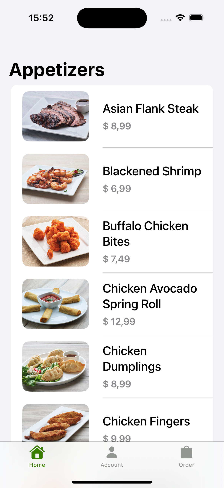
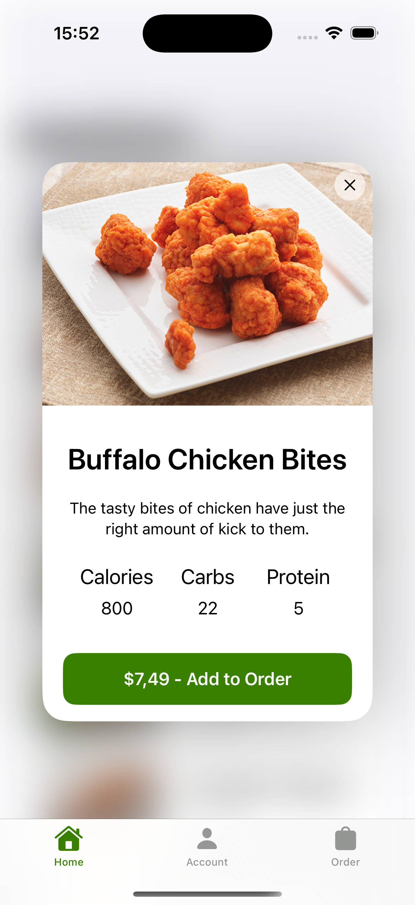
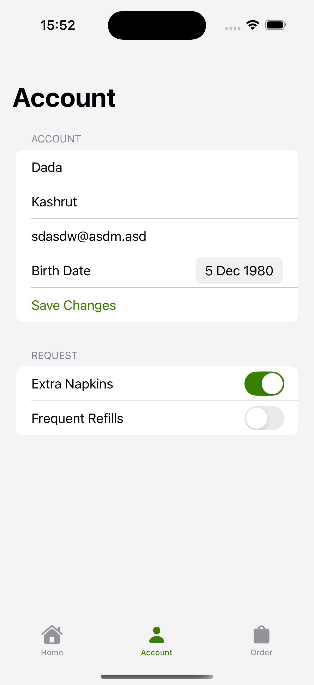
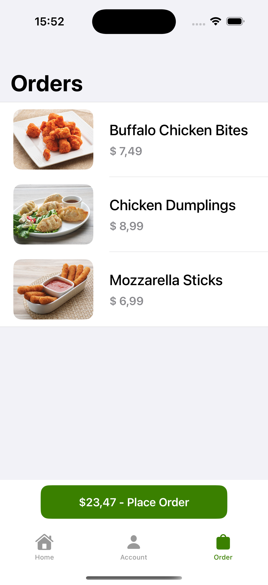

# Appetizer 🍽️

**Appetizer** is a SwiftUI-based iOS app that provides users with a delightful interface to explore and order appetizers. It is designed to demonstrate the use of modern SwiftUI components, MVVM architecture, and seamless user interactions.

## Features ✨

- 📜 **List of Appetizers**: View a curated list of appetizers with detailed information.
- 🔍 **Detail View**: Tap on an appetizer to view its detailed description, image, and price.
- 🛒 **Order Flow**: Add appetizers to your order and manage them effortlessly.
- 🧑‍💻 **Clean Architecture**: Built with SwiftUI and MVVM for scalability and maintainability.

## Screenshots 📸

### Home Screen


### Detail Screen


### Account Screen


### Order Screen


---

## Installation 🛠️

To run the **Appetizer** app on your local machine:

1. Clone the repository:
   ```bash
   git clone https://github.com/YuriyIzbash/Appetizer.git
   ```
2. Open the project in Xcode:
   ```bash
   cd Appetizer
   open Appetizer.xcodeproj
   ```
3. Ensure your Xcode version supports SwiftUI.
4. Build and run the project on a simulator or physical device.

---

## Technologies Used 🛠️

- **SwiftUI**: For building modern, declarative user interfaces.
- **Combine**: For reactive programming and data binding.
- **MVVM Architecture**: For a clean separation of concerns.
- **Networking**: Fetching and displaying appetizer data from APIs.

---

## Getting Started 🚀

### Prerequisites

- macOS with Xcode installed.
- A basic understanding of Swift and SwiftUI.

### Running the App

1. Clone the repository.
2. Open the project in Xcode.
3. Run the app on a simulator or a physical iOS device.

---

## Contribution Guidelines 🤝

Contributions are welcome! To contribute:

1. Fork the repository.
2. Create a feature branch:
   ```bash
   git checkout -b feature/your-feature-name
   ```
3. Commit your changes:
   ```bash
   git commit -m "Add your message"
   ```
4. Push the branch:
   ```bash
   git push origin feature/your-feature-name
   ```
5. Open a pull request.

---

## License 📄

This project is licensed under the [MIT License](LICENSE). Feel free to use, modify, and distribute the code.

---

## Author 👨‍💻

- **Yuriy Izbash**  
  [GitHub Profile](https://github.com/YuriyIzbash)  

---

## Acknowledgements 🙌

- Special thanks to the SwiftUI community for their support and guidance.
- Inspired by Apple’s modern design principles.
- Based on the video tutorial [by Sean Allen](https://www.youtube.com/watch?v=b1oC7sLIgpI&t=17139s).

---
